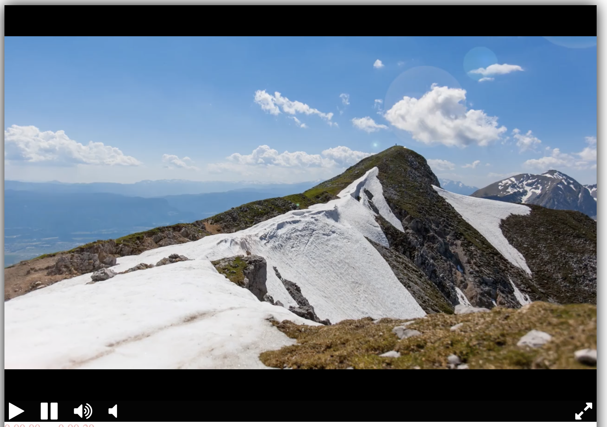

<!-- Плеер будет создан с задержкой, после того как загрузятся все ресурсы на странице. Для этого используется событие `DOMContentLoaded`. Благодаря этой особенности можно вызывать функцию `createPlayer` раньше, чем загрузятся все необходимые библиотеки: jQuery и Playable.
 -->

Построен на базе библиотеки [Playable](https://wix.github.io/playable/).

# Проект: Видеоплеер

## Описание
Этот проект представляет собой веб-видеоплеер, который можно использовать для воспроизведения видео онлайн. Плеер поддерживает кнопки управления воспроизведением, регулировкой громкости, включением/выключением звука и полноэкранным режимом.

## Функциональность
- **Воспроизведение и пауза** — кнопки для запуска и остановки видео.
- **Регулировка громкости** — возможность увеличения и уменьшения громкости.
- **Выключение звука** — отключение звука видео одним нажатием.
- **Полноэкранный режим** — возможность развернуть видео на весь экран.
- **Адаптивный интерфейс** — элементы управления автоматически подстраиваются под размер контейнера плеера.

## Технологии
- **HTML** — разметка веб-страницы.
- **CSS** — стилизация интерфейса, включая тени, flex-контейнеры и кнопки.
- **JavaScript** — управление плеером с помощью библиотеки Playable.
- **Font Awesome** — подключенные иконки для кнопок управления.

## Установка
1. Склонируйте репозиторий:
   ```sh
   git clone https://github.com/nastiaetstesha/VideoPlayer
   ```
2. Перейдите в папку проекта:
   ```sh
   cd VideoPlayer

   ```
3. Откройте `index.html` в браузере.


## Использование
- Открыть страницу в браузере.
- Управлять воспроизведением видео с помощью кнопок.
- Использовать полноэкранный режим для удобного просмотра.

## Структура проекта
```
/video-player/
├── index.html          # Главный HTML-файл
├── styles.css          # Файл стилей
├── player.js           # Скрипт управления плеером
├── favicon_io/         # Папка с favicon
│   ├── favicon.ico
│   ├── favicon-16x16.png
├── font-awesome-4.7.0/ # Иконки для кнопок управления
```

## Дополнительная информация
- Если favicon не отображается, очистите кеш браузера (`Ctrl + Shift + R` / `Cmd + Shift + R`).
- Для работы скрипта необходимо подключение к интернету для загрузки `playable.bundle.min.js`.


